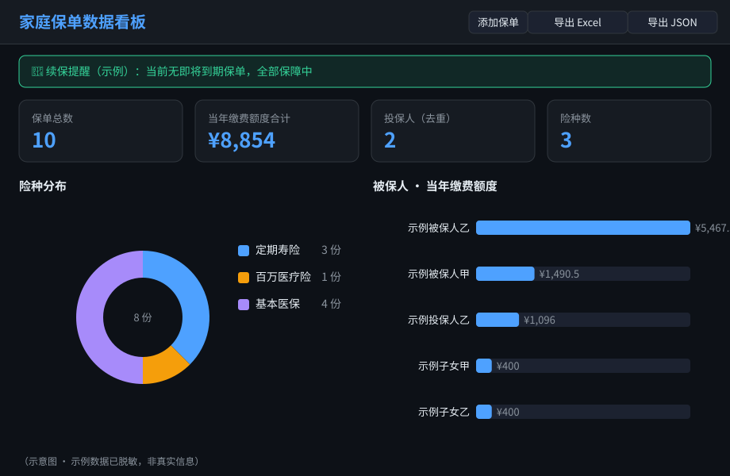
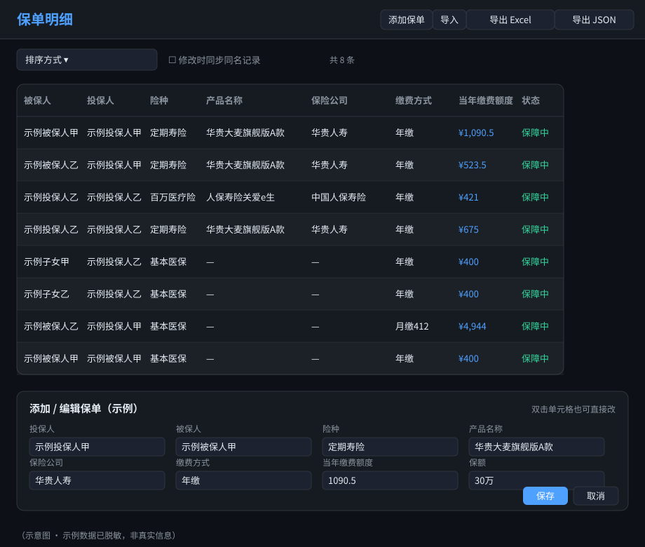
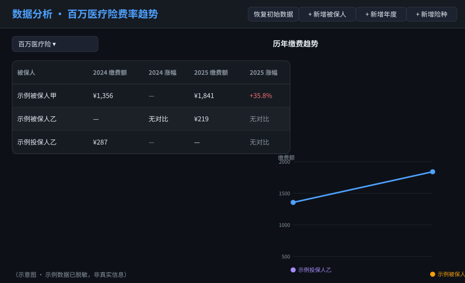

# 家庭保单数据看板

纯前端、单文件、离线可用的家庭保单管理看板。所有数据只存在你自己的浏览器里，不连接任何服务器。

> 本仓库内置的示例数据已**脱敏**，不含任何真实个人信息。

---

## 页面预览（示意图 · 数据已脱敏）

> 以下为**示意图**，使用看板内置的脱敏示例数据绘制（示例投保人甲 / 示例被保人乙 等），**不含任何真实个人信息**。实际打开看板后显示的是你自己导入的数据。

### 1. 总览与续保提醒
顶部展示保单总数、当年缴费额度合计、投保人 / 险种统计；中部为险种分布环形图与被保人缴费额度；续保提醒横幅会列出即将到期 / 已到期保单。



### 2. 保单明细与填写
明细表支持列拖拽排序、手动 / 多种排序、双击单元格直接编辑、批量同步同名记录；「添加 / 编辑保单」表单用于录入与修改基本信息（被保人、投保人、险种、产品、保险公司、缴费额度等）。



### 3. 数据分析
按险种（如百万医疗险）查看每位被保人历年缴费额与涨幅（YoY，红涨绿跌），并绘制折线趋势图；支持新增险种 / 年度 / 被保人。



---

## 一、如何运行

这是一个**单文件 HTML**，零依赖、零构建、不联网。三种方式任选：

1. **直接打开**（最简单）
   双击 `family-insurance-dashboard.html`，用任意现代浏览器打开即可。

2. **从 GitHub 拉取后打开**
   ```bash
   git clone https://github.com/wanghoufan/family-insurance-dashboard.git
   # 进入目录，双击 family-insurance-dashboard.html 用浏览器打开
   ```

3. **本地静态服务器**（可选，部分浏览器对 `file://` 限制更严时可用）
   ```bash
   cd family-insurance-dashboard
   python -m http.server 8000
   # 浏览器访问 http://localhost:8000/family-insurance-dashboard.html
   ```

> 注意：仓库里只有**脱敏示例数据**。第一次打开看到的是示例，恢复你自己的数据见下方「备份与恢复」。

---

## 二、功能特性

- **保单明细表**
  - 列可拖拽调整顺序（自动记忆）
  - 行可拖拽手动排序（选「手动拖拽排序」时）
  - 多种排序方式：添加正序 / 添加倒序 / 按姓名 / 当年缴费额度高低
  - 双击单元格直接编辑；支持新增、编辑、删除
  - 合同列：上传 / 打开 / 替换 / 删除
- **费率趋势分析**：按险种手动录入各年度缴费额，自动计算同比涨幅（YoY）
- **到期提醒**：根据保险期间标记「即将到期 / 已到期」，可开启桌面通知
- **可视化**：险种分布环形图、被保人/投保人/保险公司保费构成条形图（数字居中显示）

---

## 三、数据存储与隐私（重要）

| 数据 | 存储位置 | 是否上传 |
|------|----------|----------|
| 保单字段（被保人、险种、保费等） | 浏览器 `localStorage` | 否 |
| 合同附件（PDF/图片） | 浏览器 `IndexedDB` | 否 |
| 看板代码 / 示例数据 | 本仓库（GitHub） | 是（仅代码与脱敏示例） |

- **你的真实保单数据从不上传**，只存在你本机浏览器。
- 清空浏览器数据 / 换浏览器 / 换电脑后，看板内数据会丢失，需提前「导出」备份。

---

## 四、备份与恢复

### 保单数据（推荐）
- **备份（JSON）**：看板内点「导出 JSON」→ 下载 `家庭保单备份.json`
- **备份（Excel）**：看板内点「导出 Excel」→ 下载 `家庭保单明细表.xls`（采用当前明细表列顺序与列名，不含「合同 / 操作」按钮列，方便传播、打印和二次填写；离线生成，无需联网）
- **恢复**：看板内点「导入」→ 选择该 JSON → 数据被覆盖恢复（暂不支持直接导入 xls）
- 适用范围：换机器、清浏览器、重装后恢复保单字段

### 批量修改同名记录
- 明细表筛选区有「修改时同步同名记录」勾选框（默认勾选）。
- 修改 **被保人 / 投保人 / 险种 / 产品名称 / 保险公司** 任一字段时，所有该字段取值相同的记录会一起更新，无需逐条改。
- 取消勾选则该次修改只作用于当前这一条。

### 合同附件（注意限制）
- 合同文件存在浏览器 `IndexedDB`，**不**包含在导出的 JSON 中。
- 同一浏览器内合同始终可用；跨机器迁移时，导入 JSON 后合同不会自动回来（记录 id 会变）。
- 如需整体迁移合同，建议在同一浏览器内使用，或联系维护者增加「导出全部合同」功能。

---

## 五、常见问题

**Q：打开后是空白/示例数据，我的保单去哪了？**
A：仓库只有示例数据。若你之前在本机用过且未清浏览器，数据仍在 `localStorage`，刷新即可；若换了环境，请用「导入」恢复你的 JSON 备份。

**Q：能多人共享同一份实时数据吗？**
A：不能。这是纯本地看板，数据不联网。多人协作需各自维护，或通过导出/导入 JSON 传递。

**Q：合同文件怎么备份？**
A：目前需在同浏览器内保留；跨机器迁移请参考第四节「合同附件」说明。
